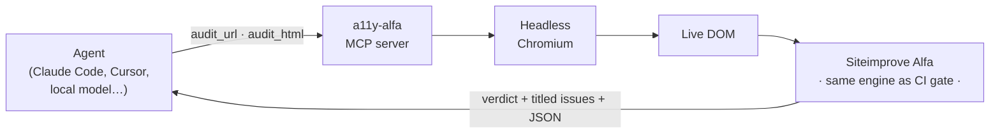

# a11y-alfa-mcp

> An **MCP server that turns this repo's accessibility audit into agent-callable tools** — powered by the same [Siteimprove Alfa](https://github.com/siteimprove/alfa) ACT-rule engine as the CI gate.


Ask any agent — Claude Code, Cursor, or a local model on an NVIDIA DGX Spark — to **audit a URL or a chunk of HTML for WCAG violations** and get back a pass/fail verdict, a titled issue list, and machine-readable JSON. Because it runs the *identical* engine and rule scope as [`tests/accessibility.spec.ts`](../tests/accessibility.spec.ts), **a green here is a green in CI.**

---

## Why this exists

This repo's [CI gate](../.github/workflows/accessibility.yml) is **deterministic and merge-blocking** — but it only audits fixed routes and can't be asked questions. This server is its **interactive, on-demand complement**:

- **Audit anything, anytime** — any URL, any HTML string, including a UI state an agent just navigated to (a modal, a filled form, an authenticated view) that a static `page.goto("/")` never renders.
- **Engine parity, not a second opinion** — default scope is WCAG 2.1 A/AA + Best Practices + ARIA, byte-for-byte the gate's target. No axe-vs-Alfa divergence to reconcile.
- **Model-agnostic** — the audit is CPU + browser work (no GPU), so drive it from cloud Claude or a local coder model just the same.

It is a **triage & authoring aid, never a replacement** for the gate. The committed spec is still what blocks merges.



---

## Quick start

```bash
cd a11y-mcp
npm install
npx playwright install chromium   # skip if the parent repo already did this
npm run build
npm run smoke                     # audits a broken + an accessible sample
```

`npm run smoke` should print a **FAIL** (5 issues) then a **PASS** (0 issues) — that's the whole thing working end to end.

---

## Use it in Claude Code

A project config is committed at the repo root ([`.mcp.json`](../.mcp.json)):

```json
{
  "mcpServers": {
    "a11y-alfa": { "command": "node", "args": ["a11y-mcp/dist/server.js"] }
  }
}
```

Run `claude` in the repo, approve the project server on first use, and confirm with `/mcp`. Then, with the dev server up (`npm run dev` in the parent):

> **You:** audit http://localhost:5173/ for accessibility
>
> **Claude:** *(calls `audit_url`)* PASS — 0 failing rules, 0 occurrences…

Prefer a one-liner over the committed file? `claude mcp add --scope project a11y-alfa -- node a11y-mcp/dist/server.js`

<details>
<summary><b>Other MCP clients (Cursor, VS Code, generic)</b></summary>

Any stdio MCP client works — point it at the built server:

```json
{
  "mcpServers": {
    "a11y-alfa": { "command": "node", "args": ["/absolute/path/to/a11y-mcp/dist/server.js"] }
  }
}
```
Use an absolute path if the client's working directory isn't the repo root.
</details>

---

## Tools

### `audit_url`
Render a URL in headless Chromium and audit its live DOM.

| Param         | Type                                                     | Default          | Notes |
| ------------- | -------------------------------------------------------- | ---------------- | ----- |
| `url`         | string (URL)                                             | —  (required)    | e.g. `http://localhost:5173/` |
| `conformance` | `wcag21aa-plus` · `wcag21aa` · `wcag22aa` · `all`        | `wcag21aa-plus`  | see [Scopes](#conformance-scopes) |

### `audit_html`
Render a raw HTML document/fragment and audit it — great for a component or agent-generated markup.

| Param         | Type                                                     | Default          |
| ------------- | -------------------------------------------------------- | ---------------- |
| `html`        | string                                                   | —  (required)    |
| `conformance` | same enum as above                                       | `wcag21aa-plus`  |

### Example — a failing audit

Calling `audit_html` on `<input type="text"><button></button>` returns:

```text
Accessibility audit (Alfa) — FAIL for inline HTML
Scope: wcag21aa-plus · 5 rule(s) failed (5 occurrence(s)); 0 rule(s) need human review (Can't Tell).

Siteimprove found accessibility issues:
  Page - Bad
  This page contains 5 issues.
    1. Button missing a text alternative (1 occurrence)
    2. Image missing a text alternative (1 occurrence)
    3. Page missing headings (1 occurrence)
    4. Form field missing a label (1 occurrence)
    5. Skip to main content link is missing (1 occurrence)
```
```json
{
  "verdict": "fail",
  "target": "inline HTML",
  "conformance": "wcag21aa-plus",
  "summary": { "rulesApplicable": 11, "rulesFailed": 5, "rulesCantTell": 0,
               "occurrencesFailed": 5, "occurrencesCantTell": 0 },
  "failedRules": [
    { "rule": "sia-r2",  "uri": "https://alfa.siteimprove.com/rules/sia-r2",  "failed": 1, "cantTell": 0 },
    { "rule": "sia-r8",  "uri": "https://alfa.siteimprove.com/rules/sia-r8",  "failed": 1, "cantTell": 0 }
  ]
}
```

The human-readable block is the *same report the CI job prints*. The JSON block is for programmatic use. A clean page returns `verdict: "pass"` with `This page contains 0 issues.`

---

## Conformance scopes

| Value                     | Rules included                                              |
| ------------------------- | ---------------------------------------------------------- |
| `wcag21aa-plus` (default) | WCAG 2.1 A/AA **+ Alfa Best Practices + ARIA** — the CI gate |
| `wcag21aa`                | WCAG 2.1 A/AA success criteria only                        |
| `wcag22aa`                | Latest AA (WCAG 2.2)                                       |
| `all`                     | Every stable Alfa rule (includes AAA)                     |

**Pass/fail semantics** match the gate: the verdict is `fail` only when a rule has a **definite failure** (`failed > 0`). Alfa's **`cantTell`** outcomes — checks that need a human — are surfaced in `summary.rulesCantTell` for review, never counted as failures.

---

## Typical workflows

- **Triage a red PR** — the gate failed on a route; ask the agent to `audit_url` it, read the titled issues, and fix `index.html` / `src/*` before re-running the deterministic spec.
- **Check a component in isolation** — `audit_html` a fragment while iterating, no dev server or route needed.
- **Audit a hard-to-reach state** — pair with a browser-driving MCP (e.g. `@playwright/mcp`): the agent opens a modal / fills a form / logs in, then calls `audit_url` on that state. Turn what it finds into a new `test()` that the gate will guard.

---

## How it works

```
audit_url / audit_html
        │
        ▼
Playwright  ──►  headless Chromium renders the DOM (post-CSS, post-JS)
        │
        ▼
@siteimprove/alfa-playwright  ──►  hands the live document to Alfa
        │
        ▼
@siteimprove/alfa-test-utils  ──►  Audit.run(page, { rules: { include: <scope> } })
        │
        ▼
verdict + titled issues (Logging) + structured JSON (resultAggregates)
```

The scope predicate is the exact one from the CI spec — that's what guarantees parity.

---

## Security

- The server launches a **local headless Chromium** and navigates only to URLs **you pass it** — treat that like any `fetch`. Keep it pointed at local/trusted origins.
- It is **read-only**: it renders and audits the DOM. It never clicks, types, submits, or persists anything.
- No network egress beyond loading the target page; no data leaves the machine (the Alfa engine runs locally).

---

## Development

```
a11y-mcp/
├── src/
│   ├── server.ts    # MCP wiring: registers audit_url + audit_html over stdio
│   └── audit.ts     # browser lifecycle, Alfa audit, report formatting
├── smoke.mjs        # spawns the built server and runs a pass + fail audit
├── package.json
└── tsconfig.json
```

| Script            | Does |
| ----------------- | ---- |
| `npm run build`   | `tsc` → `dist/` |
| `npm run typecheck` | type-check only |
| `npm run start`   | run the built server (`node dist/server.js`) |
| `npm run smoke`   | end-to-end check via a real MCP client |

Built on the official [`@modelcontextprotocol/sdk`](https://github.com/modelcontextprotocol/typescript-sdk), [`playwright`](https://playwright.dev/), and `@siteimprove/alfa-*`.

---

## Troubleshooting

| Symptom | Fix |
| ------- | --- |
| Client shows the server as *failed to connect* | Build it first: `cd a11y-mcp && npm install && npm run build`. The config runs `dist/server.js`. |
| `browserType.launch: Executable doesn't exist` | `npx playwright install chromium` inside `a11y-mcp/`. |
| `audit_url` times out | The page must be reachable and finish loading within 30s — start your dev server, use an absolute URL. |
| Tool output looks empty in logs | The server logs only to **stderr**; stdout is the MCP transport. That's expected. |

---

## Relationship to the CI gate

```
CI gate (deterministic, blocks merges)   ── enforces ──►  fixed routes, every PR
        ▲   same Alfa engine, same rule scope
        │
this MCP (interactive, agent-callable)   ── advises ───►  any URL / state, on demand
```

Findings agree because the engine is identical. Anything you fix with the MCP's help is then verified by the unchanged gate — the MCP speeds up *getting to green*; the gate is what *keeps* you there.

---

**See also:** [parent repo README](../README.md) · [full CI guide](../docs/CI-ACCESSIBILITY-GUIDE.md) · [Alfa engine](https://github.com/siteimprove/alfa) · [Model Context Protocol](https://modelcontextprotocol.io/)
