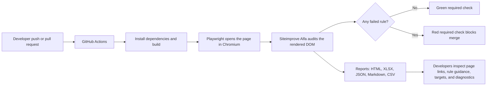

# How the accessibility CI works — for Nathan

**Nathan:** “What happens when someone pushes a change?”

**Answer:** GitHub Actions checks out the code, builds the site, starts it locally,
and runs the same Playwright test developers run with `npm run test:a11y`.

**Nathan:** “Where does accessibility testing fit in?”

**Answer:** Playwright opens the page in Chromium. Siteimprove Alfa receives that
rendered DOM and checks the configured WCAG 2.1 A/AA, Best Practices, and ARIA rules.
It is testing what the browser produced, not just source files.

**Nathan:** “What does a failure give a developer?”

**Answer:** The CI log prints a short “where to look” list for every failed or
indeterminate rule: the audited page, rule-guidance URL, occurrence count, and the
exact target/diagnostic trail. CI also generates files with the complete evidence,
downloadable from the Playwright report and the GitHub Actions artifact; local runs
stay terminal-only.

**Nathan:** “How does this stop regressions?”

**Answer:** A failed rule makes the Playwright test fail. Once **Accessibility audit
(Alfa)** is a required GitHub check, a pull request cannot merge until the failure is
fixed or the check is green again. Human review remains necessary for what automation
cannot decide, such as meaningful alt text and complex keyboard behavior.
